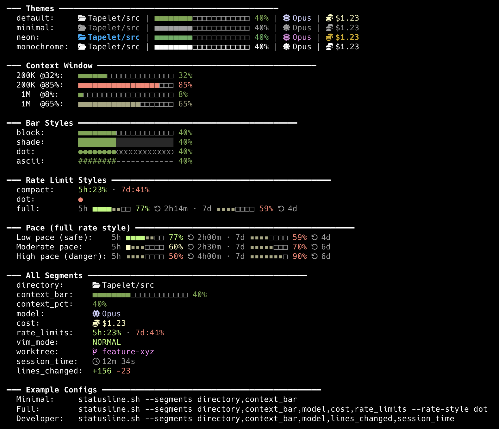

# claude-statusline

Configurable statusline for [Claude Code](https://docs.anthropic.com/en/docs/claude-code). Single bash script, modular segments, multiple themes.



## Features

- **11 segments** — project, directory, context bar, context %, model, cost, rate limits, vim mode, worktree, session time, lines changed
- **4 themes** — default (gradient), minimal, neon, monochrome
- **4 bar styles** — block `■□`, shade `█░`, dot `●○`, ascii `#-`
- **3 rate limit styles** — compact, dot, full (3-zone pace bar + countdown)
- **3 icon sets** — nerd (Nerd Font), unicode, none — plus custom icon sets
- **Pace-based rate coloring** — colors reflect projected usage, not just current percentage
- **Fast** — single `jq` call, rest is bash arithmetic (~30ms)
- **Compatible** — macOS bash 3.2+, no dependencies beyond `jq`

## Install

```bash
git clone https://github.com/vkartaviy/statusline.git
cd statusline
bash install.sh
```

Or manually — add to `~/.claude/settings.json`:

```json
{
  "statusLine": {
    "type": "command",
    "command": "bash /path/to/statusline.sh --segments project,directory,context_bar,cost,rate_limits --theme neon --icons nerd --rate-style full"
  }
}
```

### Nerd Font (recommended)

For `--icons nerd` (default), install a [Nerd Font](https://www.nerdfonts.com/) and set it as your terminal font:

```bash
# Pick one:
brew install --cask font-jetbrains-mono-nerd-font
brew install --cask font-hack-nerd-font
brew install --cask font-fira-code-nerd-font
```

Then set the font in your terminal (e.g. Warp: Settings → Appearance → Terminal font).

> **Tip:** Choose the regular variant (e.g. "JetBrains Mono Nerd Font"), not the Mono variant.
> The Mono version forces icons into a single-width cell, making them appear tiny.
> The regular version renders icons at their natural width.

Without a Nerd Font, use `--icons unicode` or `--icons none`.

## Usage

```
bash statusline.sh [OPTIONS]
```

| Option | Default | Description |
|--------|---------|-------------|
| `--segments LIST` | `directory,context_bar` | Comma-separated segment names |
| `--theme NAME` | `default` | Theme: `default`, `minimal`, `neon`, `monochrome` |
| `--icons STYLE` | `nerd` | Icon set: `nerd`, `unicode`, `none`, or custom |
| `--bar-width N` | `20` | Bar width in characters |
| `--bar-style STYLE` | `block` | Bar style: `block`, `shade`, `dot`, `ascii` |
| `--separator STR` | ` \| ` | String between segments |
| `--rate-style STYLE` | `compact` | Rate display: `compact`, `dot`, `full` |
| `--no-icons` | — | Alias for `--icons none` |
| `--no-color` | — | Disable all ANSI codes |
| `--config PATH` | `~/.config/claude-statusline/config` | Config file path |
| `--help` | — | Show help |

Config hierarchy: CLI flags > config file > built-in defaults.

## Segments

| Segment | Output | Description |
|---------|--------|-------------|
| `project` | `statusline` | Project root name |
| `directory` | `apps/web/src` | Path relative to project, smart collapse |
| `context_bar` | `■■■■■■□□□□□□□□ 42%` | Context window usage bar |
| `context_pct` | `42%` | Context percentage only |
| `model` | `Opus 4.6 (1M context)` | Model display name |
| `cost` | `$1.23` | Session cost (rounded to 2 decimals) |
| `rate_limits` | `5h:23% · 7d:41%` | API rate limits (see rate styles) |
| `vim_mode` | `NORMAL` | Vim mode indicator |
| `worktree` | `feature-xyz` | Git worktree name (hidden if not in worktree) |
| `session_time` | `12m 34s` | Session duration |
| `lines_changed` | `+156 -23` | Lines added/removed |

All segments read JSON from Claude Code stdin. The `directory` segment also checks the filesystem to detect sibling directories for smart path collapsing.
Context bar auto-adapts to both 200K and 1M context windows.

### Directory collapse

The `directory` segment shows your path relative to the project root. Long paths are collapsed smartly:

- **Short paths** shown fully: `apps/web/src`
- **Long paths** with siblings: `apps/server/src/…/auth` (keeps 3 components for disambiguation)
- **Long paths** without siblings: `lib/core/…/auth` (safe to collapse after 2)
- **In project root**: hidden (the `project` segment handles it)

## Themes

| Theme | Description |
|-------|-------------|
| `default` | Green → yellow → red gradient |
| `minimal` | Dim/subtle colors |
| `neon` | Vivid 256-color, slightly muted |
| `monochrome` | No ANSI codes |

## Icons

| `--icons` | Requires | Example |
|-----------|----------|---------|
| `nerd` | Nerd Font | `statusline` |
| `unicode` | Any font | `◆ statusline` |
| `none` | — | `statusline` |

**Custom icons:** create a file in `icons/` (see `icons/example.sh`) and use `--icons <name>`.

## Rate Limit Styles

| `--rate-style` | Output | Description |
|----------------|--------|-------------|
| `compact` | `5h:23% · 7d:41%` | Percentage used |
| `dot` | `●` | Single colored dot |
| `full` | `5h ■■■■▪▪□□ 77% ⟳2h · 7d ■■▪▪□□□□ 59% ⟳4d` | 3-zone bar + countdown |

### Pace-based coloring

Colors reflect **projected usage** at end of the window, not just current percentage:
- 50% used in the first hour of a 5h window → red (on pace to exceed limit)
- 80% used with 30 minutes left → yellow (window almost over, pace is fine)

The `full` bar has three zones:
- `■` — **safe**: will remain even at current pace
- `▪` — **at risk**: projected to be consumed at current pace
- `□` — **used**: already consumed

Pace activates after 20% of the window has elapsed and usage exceeds 20%.
Thresholds (by projected usage): green <70%, yellow 70-90%, red >90%.

## Preview

```bash
bash preview.sh              # Show everything
bash preview.sh --theme neon  # Preview one theme
```

## Examples

**Minimal:**
```json
{
  "statusLine": {
    "type": "command",
    "command": "bash statusline.sh --segments project,context_bar"
  }
}
```

**Full monitoring:**
```json
{
  "statusLine": {
    "type": "command",
    "command": "bash statusline.sh --segments project,directory,context_bar,cost,rate_limits --theme neon --icons nerd --rate-style full"
  }
}
```

**Developer:**
```json
{
  "statusLine": {
    "type": "command",
    "command": "bash statusline.sh --segments project,directory,context_bar,lines_changed,session_time"
  }
}
```

**Plain text:**
```json
{
  "statusLine": {
    "type": "command",
    "command": "bash statusline.sh --icons none --no-color"
  }
}
```

## Config File

`~/.config/claude-statusline/config`:

```
SEGMENTS=project,directory,context_bar,cost,rate_limits
THEME=neon
BAR_WIDTH=20
BAR_STYLE=block
SEPARATOR= |
RATE_STYLE=full
ICONS=nerd
```

## License

MIT
